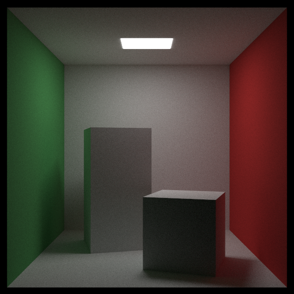

# RayTracer

This repo is to track my progress following the book series "Ray Tracing ***[in X amount of time]***"

## Progress
- [X] [_Ray Tracing in One Weekend_](https://raytracing.github.io/books/RayTracingInOneWeekend.html)
- [X] [_Ray Tracing: The Next Week_](https://raytracing.github.io/books/RayTracingTheNextWeek.html)
- [ ] [_Ray Tracing: The Rest of Your Life_](https://raytracing.github.io/books/RayTracingTheRestOfYourLife.html)

## Additional Features
- [X] Output to other file formats (PNG)
- [X] Multithreading